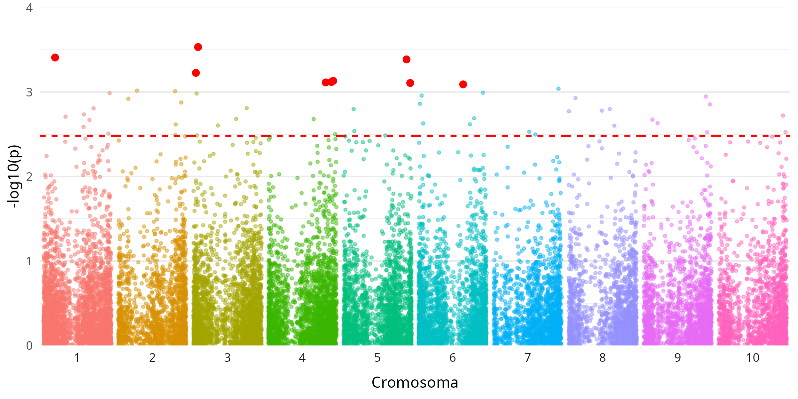

# GWAS Protocol for native maize from Morelos, MX  

This was the coding section for my thesis, which consisted on the identification of single nucleotide polymorphisms (SNPs) related to draught resistance of native *Zea mays* L. from Morelos, MX.

Thanks to the Dr. Cassab's research group at [IBt - UNAM](https://www.ibt.unam.mx/perfil/1417/dra-gladys-iliana-cassab-lopez) for letting me share this part of my project.



## Use Project

The R Project is located in the `r-project/` directory; without datasets. 

You can download the `zip` file directly. Or *clone* this repository with:

```
git clone https://github.com/robolvhez/gwas_native-maize.git
```

## Obtain Data
### UNIX Systems (Linux or macOS)

If you use a Linux machine or macOS, you can extract data from `DMz23_119.tar.gz` zipped files using this command on terminal:

```shell
# UNIX Systems
tar -xzvf DMz23_119.tar.gz -C r-project/data/
```

This should extract all files into the `data/` directory from which R will read data.

### Windows
On **Windows** systems, unzip manually the `DMz23_119.zip` file and move the contents to `r-project/data/`.

## GWAS Procedure

This GWAS was performed in [TASSEL 5.0](https://bitbucket.org/tasseladmin/tassel-5-source/wiki/UserManual), according to user's manual for the [MLM (Mixed Linear Model)](https://bitbucket.org/tasseladmin/tassel-5-source/wiki/UserManual/MLM/MLM) workflow.

Phenotype and genotype datasets are provided in the `DMz23_119` compressed files.

